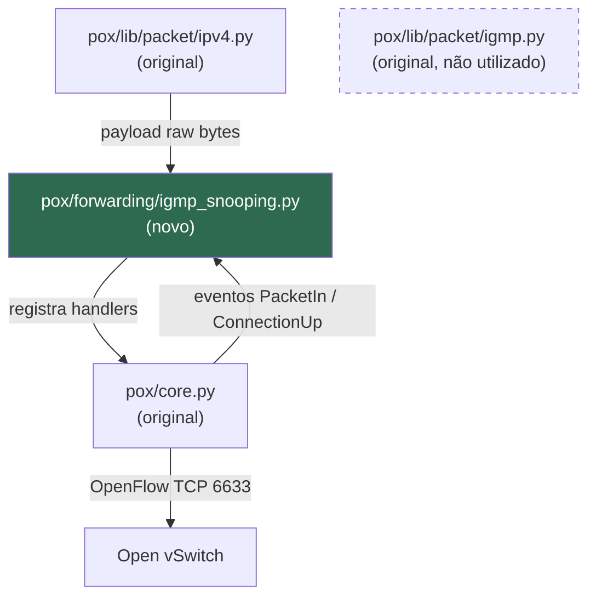
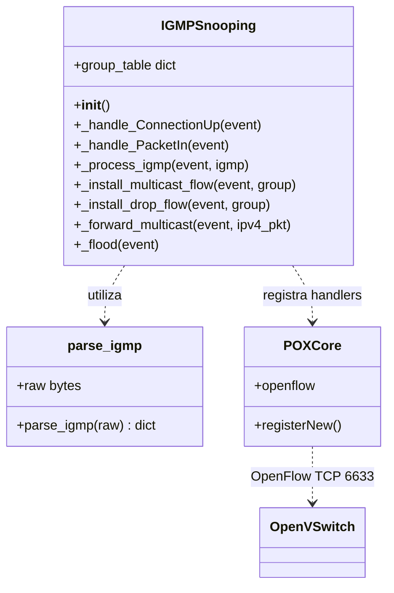
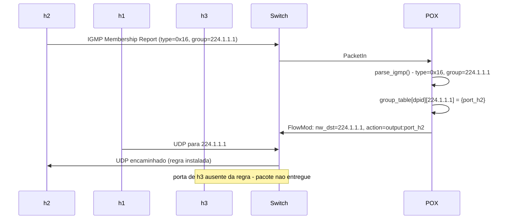
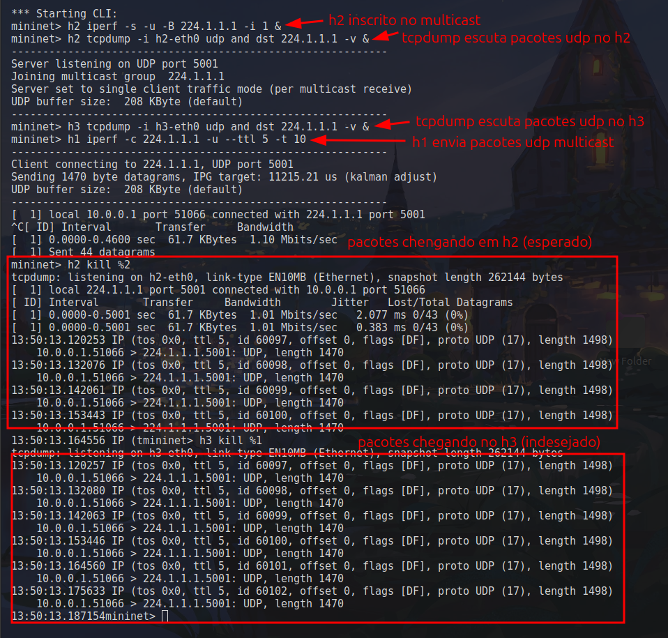
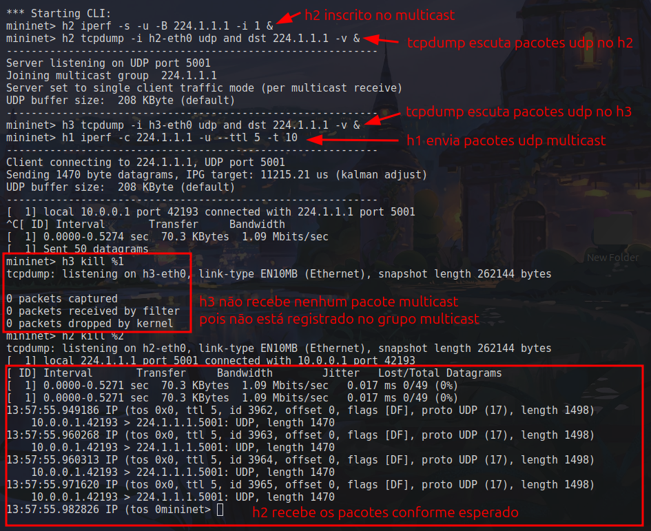
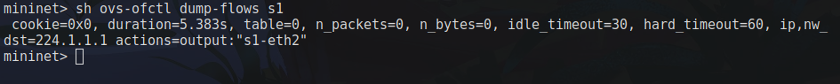

# IGMP Snooping no POX

**Universidade de Caxias do Sul - Redes de Computadores**

Prof. Maria de Fátima

Gabriel Vieira e Rafael Graunke

---

## 1. Descrição da Funcionalidade Implementada

### Objetivo, Motivação e Benefícios

O POX é um controlador SDN em Python que suporta OpenFlow 1.0. Em redes SDN, o controlador decide como o tráfego é encaminhado pelos switches. Por padrão, quando um pacote multicast chega a um switch gerenciado pelo POX, o controlador instala regras de encaminhamento que replicam o tráfego para todas as portas, comportamento equivalente a um broadcast. Isso ocorre porque o POX não possui nenhuma lógica para distinguir quais hosts têm interesse em receber determinado grupo multicast.

O IGMP (*Internet Group Management Protocol*) é o protocolo utilizado por hosts para informar à rede que desejam receber tráfego de um grupo multicast específico. Um host envia uma mensagem *Membership Report* (tipo `0x16`) ao ingressar num grupo e uma mensagem *Leave Group* (tipo `0x17`) ao sair. Sem que o controlador interprete essas mensagens, todo tráfego multicast é tratado como broadcast, desperdiçando banda e processamento nos hosts que não têm interesse no conteúdo.

Este trabalho implementa **IGMP Snooping** no POX: o controlador passa a interceptar e interpretar os cabeçalhos IGMP, mantendo uma tabela de quais portas do switch possuem hosts inscritos em cada grupo multicast. Com base nessa tabela, instala regras OpenFlow direcionadas, de modo que o tráfego multicast chegue apenas às portas com assinantes ativos.

**Benefícios:**
- Elimina flooding desnecessário de tráfego multicast
- Reduz processamento em hosts não inscritos
- Funcionalidade genuinamente ausente no POX, integração puramente aditiva

### Requisitos Atendidos

- Interpretação dos campos `type` e `group address` do cabeçalho IGMP
- Manutenção de tabela `(switch, grupo) -> conjunto de portas`
- Instalação de regras OpenFlow direcionadas ao receber tráfego multicast
- Remoção de porta da tabela ao receber *Leave Group*
- Fallback para flood quando grupo não possui assinantes conhecidos

### Limitações

- Suporta apenas IGMPv2 (tipos `0x16` e `0x17`); IGMPv3 não implementado; hosts Mininet configurados com `force_igmp_version=2` para compatibilidade
- Sem suporte a *Querier* IGMP (o controlador não envia *General Queries*)
- Entradas na tabela não expiram por tempo (*timeout*); remoção ocorre apenas via *Leave*
- Testado exclusivamente com Open vSwitch em topologia Mininet

---

## 2. Integração com o Software Original

### Arquivos Adicionados

| Arquivo | Papel |
|---------|-------|
| `pox/forwarding/igmp_snooping.py` | Componente POX: interpreta cabeçalhos IGMP e instala regras OpenFlow |
| `ext/topo_igmp_demo.py` | Topologia Mininet para demonstração (3 hosts + 1 switch) |

### Arquivos Originais Modificados

Nenhum arquivo original do POX foi modificado. A integração é puramente aditiva: o novo componente se registra nos eventos do core do POX sem alterar nenhum módulo existente.

### Ponto de Integração

O POX expõe um sistema de eventos ao qual qualquer componente pode se registrar. O componente `igmp_snooping` utiliza dois eventos já existentes no core:

| Evento POX | Quando dispara | Uso no componente |
|------------|----------------|-------------------|
| `ConnectionUp` | Switch conecta ao controlador | Inicializa estrutura de dados para o switch |
| `PacketIn` | Switch envia pacote ao controlador | Inspeciona cabeçalho IGMP; atualiza tabela; instala regra |

Não é necessário modificar o core do POX nem os módulos de encaminhamento existentes (`l2_learning`, `l3_learning`, etc.). O componente coexiste com eles e pode ser carregado de forma independente.

---

## 3. Detalhamento Técnico da Implementação

### Descrição do Desenvolvimento

O componente foi desenvolvido como um módulo autônomo em `pox/forwarding/igmp_snooping.py`, sem modificar nenhum arquivo existente do POX. A decisão central foi implementar o parser IGMP manualmente via `struct.unpack`, em vez de utilizar o parser já existente em `pox/lib/packet/igmp.py`, tornando explícita a interpretação de cada campo do cabeçalho.

O estado do componente é mantido em um dicionário aninhado (`group_table`) indexado por DPID do switch e endereço do grupo multicast. Cada entrada contém o conjunto de portas com assinantes ativos.

A integração com o POX se dá exclusivamente pelo sistema de eventos do core: `ConnectionUp` para inicializar o estado por switch, e `PacketIn` para processar pacotes IGMP e encaminhar tráfego multicast.

### Funções, Classes e Módulos

#### `pox/forwarding/igmp_snooping.py`

| Símbolo | Tipo | Papel |
|---------|------|-------|
| `parse_igmp(raw)` | função | deserializa manualmente os 8 bytes do cabeçalho IGMPv2 via `struct.unpack("!BBH4s", ...)` |
| `IGMPSnooping` | classe | componente POX principal; mantém `group_table[dpid][group] = set(ports)` |
| `__init__()` | método | inicializa `group_table` e registra handlers no `core.openflow` |
| `_handle_ConnectionUp(event)` | método | inicializa entrada `group_table[dpid] = {}` quando switch conecta |
| `_handle_PacketIn(event)` | método | identifica pacotes IGMP (IPv4 proto=2) e tráfego multicast; delega ao método adequado |
| `_process_igmp(event, igmp)` | método | lê `igmp['type']` e `igmp['group']`; atualiza tabela; aciona instalação de regra |
| `_install_multicast_flow(event, group)` | método | instala regra OpenFlow com `nw_dst=group`, output para cada porta inscrita |
| `_install_drop_flow(event, group)` | método | instala regra de descarte quando grupo não tem mais assinantes |
| `_forward_multicast(event, ipv4_pkt)` | método | encaminha tráfego multicast não-IGMP para portas conhecidas, ou flood |
| `_flood(event)` | método | envia `packet_out` com `OFPP_FLOOD` |
| `launch()` | função | entry point para `pox.py`; registra instância via `core.registerNew` |

### Fluxo de Execução

1. `pox.py` carrega `igmp_snooping`
2. `IGMPSnooping.__init__()` registra os handlers `_handle_ConnectionUp` e `_handle_PacketIn`
3. Ao receber `ConnectionUp`: inicializa `group_table[dpid] = {}`
4. Ao receber `PacketIn`: extrai o payload e tenta parsear como IGMP
   - Se não for IGMP: encaminha normalmente (flood)
   - Se for IGMP: chama `_process_igmp(dpid, port, igmp)`
     - Se `type == 0x16` (Join): adiciona a porta ao grupo na tabela
     - Se `type == 0x17` (Leave): remove a porta do grupo na tabela
     - Chama `_install_multicast_flow()`: instala regra com destino igual ao grupo e saída apenas nas portas inscritas

### Interpretação de Cabeçalhos de Protocolos

#### Cabeçalho IGMP (8 bytes)

| Campo | Offset | Tamanho | Valores interpretados |
|-------|--------|---------|----------------------|
| `Type` | 0 | 1 byte | `0x16` = Membership Report (Join); `0x17` = Leave Group |
| `Max Resp Time` | 1 | 1 byte | ignorado nesta implementação |
| `Checksum` | 2 | 2 bytes | integridade do cabeçalho (big-endian) |
| `Group Address` | 4 | 4 bytes | endereço IPv4 multicast do grupo (ex.: `224.1.1.1`) |

O cabeçalho é deserializado manualmente via `struct.unpack`, sem uso do parser existente em `pox/lib/packet/igmp.py`:

```python
import struct
import socket

def parse_igmp(raw):
    type_, max_resp, checksum, group_bytes = struct.unpack("!BBH4s", raw[:8])
    return {
        'type':     type_,
        'max_resp': max_resp,
        'checksum': checksum,
        'group':    socket.inet_ntoa(group_bytes),
    }
```

`struct.unpack("!BBH4s", ...)` mapeia diretamente os bytes do wire:
- `!`: big-endian (network byte order)
- `B`: 1 byte unsigned: `type`
- `B`: 1 byte unsigned: `max_resp_time`
- `H`: 2 bytes unsigned: `checksum`
- `4s`: 4 bytes raw, convertido para string IPv4 com `socket.inet_ntoa`

#### Encapsulamento

O pacote IGMP chega encapsulado da seguinte forma:

- Camada 2: Ethernet com destino `01:00:5e:xx:xx:xx` (endereço multicast mapeado)
- Camada 3: IPv4 com protocolo `2` (reservado para IGMP) e destino `224.x.x.x`
- Camada 4: IGMP com `type` igual a `0x16` ou `0x17` e `group` com o endereço do grupo

O protocolo IP reserva o número `2` para IGMP no campo `protocol` do cabeçalho IPv4. O endereço de destino multicast no cabeçalho Ethernet é derivado do grupo (`01:00:5e` + 23 bits do endereço IP).

---

## 4. Diagramas

### Diagrama de Módulos



### Diagrama de Classes



### Diagrama de Sequência



---

## 5. Procedimentos de Execução e Validação

### Requisitos

```bash
python3 --version    # Python 3.x
ovs-vsctl --version  # Open vSwitch
mn --version         # Mininet
iperf --version      # iperf (gerador de tráfego UDP)
tcpdump --version    # captura de pacotes
```

### Demonstração: Ausência de Snooping (baseline)

Prova que sem o componente, h3 recebe tráfego multicast sem ter se inscrito.

**Terminal 1: POX sem snooping:**
```bash
cd ~/projects/pox
python3 pox.py log.level --DEBUG forwarding.l2_learning
```

**Terminal 2: Mininet:**
```bash
sudo python3 ext/topo_igmp_demo.py
```

**No prompt `mininet>`:**
```
mininet> h2 iperf -s -u -B 224.1.1.1 -i 1 &
mininet> h2 tcpdump -i h2-eth0 udp and dst 224.1.1.1 -v &
mininet> h3 tcpdump -i h3-eth0 udp and dst 224.1.1.1 -v &
mininet> h1 iperf -c 224.1.1.1 -u --ttl 5 -t 10
mininet> h2 kill %2
mininet> h3 kill %1
```

**Resultado esperado:** h3 captura pacotes UDP, flooding sem controle.

---

### Demonstração: Com IGMP Snooping

**Terminal 1: POX com snooping:**
```bash
cd ~/projects/pox
python3 pox.py log.level --DEBUG forwarding.igmp_snooping
```

**Terminal 2: Mininet (mesmo script):**
```bash
sudo python3 ext/topo_igmp_demo.py
```

**No prompt `mininet>`:**
```
mininet> h2 iperf -s -u -B 224.1.1.1 -i 1 &
mininet> h2 tcpdump -i h2-eth0 udp and dst 224.1.1.1 -v &
mininet> h3 tcpdump -i h3-eth0 udp and dst 224.1.1.1 -v &
mininet> h1 iperf -c 224.1.1.1 -u --ttl 5 -t 10
mininet> h2 kill %2
mininet> h3 kill %1
```

**Resultado esperado:** h3 não captura nada, tráfego direcionado apenas a h2.

---

### Casos de Teste

| # | Caso | Entrada | Resultado Esperado |
|---|------|---------|-------------------|
| T1 | Flood sem snooping | `l2_learning` + multicast h1 para h2 | h3 captura pacotes UDP |
| T2 | Sem inscrição | `igmp_snooping` + multicast sem Join | tráfego não chega a nenhum host |
| T3 | Join de h2 | h2 executa `iperf -s -B 224.1.1.1` | h2 recebe tráfego; h3 não recebe |
| T4 | Leave de h2 | h2 encerra iperf (envia Leave) | h2 para de receber tráfego |
| T5 | Join de h2 e h3 | ambos executam iperf -s | ambos recebem tráfego |

### Evidências

**T1 — Sem IGMP Snooping (`l2_learning`): h3 recebe tráfego multicast sem estar inscrito**



**T3 — Com IGMP Snooping: h3 captura 0 pacotes; h2 recebe normalmente**



**Regra OpenFlow instalada no switch após Join de h2**



Interpretação dos campos da regra:

- **`cookie=0x0`**: identificador da regra (não definido pelo componente)
- **`duration`**: tempo em segundos desde que a regra foi instalada
- **`table=0`**: tabela de fluxo 0, única tabela no OpenFlow 1.0
- **`n_packets, n_bytes`**: contador de pacotes e bytes que casaram com a regra
- **`idle_timeout=30`**: regra expira após 30s sem tráfego correspondente
- **`hard_timeout=60`**: regra expira após 60s independentemente do tráfego
- **`ip,nw_dst=224.1.1.1`**: condição de casamento: pacotes IPv4 com destino `224.1.1.1`
- **`actions=output:"s1-eth2"`**: ação: encaminhar para a porta `s1-eth2` (porta de h2)

A porta de h3 (`s1-eth3`) está ausente das ações, confirmando que o snooping funciona: apenas h2, que enviou o IGMP Join, recebe o tráfego multicast.

---

## Uso de IA Generativa (GPT)

### a) Ferramenta Utilizada

- **Claude Code** (Anthropic), modelo `claude-sonnet-4-6`, via CLI no terminal

### b) Objetivo do Uso

- Sugestão e avaliação de funcionalidades candidatas para o projeto
- Geração do esboço de `igmp_snooping.py`
- Geração do script de topologia de demonstração (`topo_igmp_demo.py`)
- Estruturação desta documentação

### c) Prompts e Respostas Relevantes

#### Prompt 1: Escolha da funcionalidade
> "I need to implement a new feature for POX. Our initial idea was OpenFlow 1.1 but we want something simpler. Suggest alternatives."

**Retorno resumido:** sugestão de três opções (IGMP Snooping, TCP SYN flood detector, VLAN-aware forwarding) com justificativas de complexidade e demonstrabilidade.
**Aproveitado:** escolha do IGMP Snooping como tema; estrutura da demonstração ausência/presença.
**Descartado:** opções alternativas (TCP SYN, VLAN).

#### Prompt 2: Script de topologia de demonstração
> "Create a simple mininet infrastructure to demonstrate the lack of IGMP snooping"

**Retorno resumido:** geração de `ext/topo_igmp_demo.py` com topologia Mininet de 3 hosts e 1 switch, adição automática de rotas multicast em cada host, escrita de PIDs em `/tmp/igmp_demo_pids` e exibição das instruções de uso no terminal.

```python
from mininet.net import Mininet
from mininet.node import OVSSwitch, RemoteController
from mininet.cli import CLI
from mininet.log import setLogLevel


def run():
    setLogLevel('info')

    net = Mininet(switch=OVSSwitch, controller=RemoteController)

    net.addController('c0', ip='127.0.0.1', port=6633)
    s1 = net.addSwitch('s1')
    h1 = net.addHost('h1')
    h2 = net.addHost('h2')
    h3 = net.addHost('h3')

    net.addLink(h1, s1)
    net.addLink(h2, s1)
    net.addLink(h3, s1)

    net.start()

    for host in [h1, h2, h3]:
        host.cmd('route add -net 224.0.0.0 netmask 240.0.0.0 dev %s-eth0' % host.name)

    with open('/tmp/igmp_demo_pids', 'w') as f:
        f.write(f"{net['h2'].pid}\n{net['h3'].pid}\n")

    CLI(net)
    net.stop()


if __name__ == '__main__':
    run()
```

**Aproveitado:** estrutura completa do script; adição das rotas multicast (necessária após erro "Network is unreachable" no teste real).

**Descartado:** escrita dos PIDs em `/tmp/igmp_demo_pids` (era para integração com script tmux removido posteriormente).

#### Prompt 3: Implementação do componente igmp_snooping
> "Sketch the igmp_snooping.py module"

**Retorno resumido:** geração de `pox/forwarding/igmp_snooping.py` com parser manual IGMPv2 via `struct.unpack`, classe `IGMPSnooping` com handlers para `ConnectionUp` e `PacketIn`, lógica de Join/Leave, instalação de regras OpenFlow e flood de fallback.
**Aproveitado:** estrutura completa do componente; parser manual `parse_igmp()`; lógica de `_install_multicast_flow` e `_install_drop_flow`.
**Descartado:** nada de relevância; código revisado e validado integralmente pelo grupo.

### d) Rastreabilidade no Código

| Arquivo | Influência da IA |
|---------|-----------------|
| `pox/forwarding/igmp_snooping.py` | esboço gerado pela IA; revisado e validado pelo grupo |
| `ext/topo_igmp_demo.py` | gerado pela IA; rotas multicast adicionadas após teste real |
| `docs/relatorio.md` | estrutura gerada pela IA; conteúdo técnico preenchido pelo grupo |

### e) Validação Técnica

- **Conferência com RFC 2236 (IGMPv2):** os offsets e tamanhos dos campos `type` (byte 0), `max_resp_time` (byte 1), `checksum` (bytes 2-3) e `group address` (bytes 4-7) foram conferidos contra a especificação. O formato `struct.unpack("!BBH4s", ...)` foi verificado campo a campo.
- **Validação via tcpdump:** captura real com `tcpdump -v` confirmou que os pacotes IGMP enviados pelo iperf contêm `type=0x16` (Membership Report) no momento do join, e que o campo group address corresponde a `224.1.1.1`.
- **Validação via ovs-ofctl:** o comando `ovs-ofctl dump-flows s1` confirmou que a regra instalada pelo componente contém `nw_dst=224.1.1.1` e `actions=output:"s1-eth2"` (porta de h2), sem incluir a porta de h3.
- **Teste de ausência vs presença:** execução com `l2_learning` mostrou h3 recebendo pacotes (flood); execução com `igmp_snooping` mostrou `0 packets captured` em h3 e recepção normal em h2. Evidências registradas nas seções 5.
